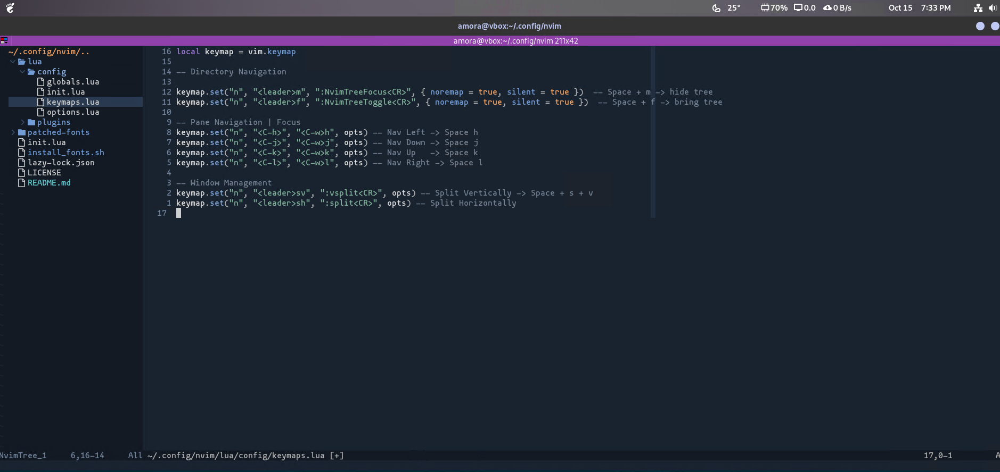

# Neovim Configuration Setup

This repository contains a Neovim configuration tailored for optimal usability, integrated with Alacritty as the terminal emulator. Follow the steps below to set it up.



## Table of Contents
- [Installation](#installation)
- [Configuration Structure](#configuration-structure)
- [Key Mappings](#key-mappings)
- [Testing the Setup](#testing-the-setup)

## Installation

1. **Clone the Repository:**
   ```bash
   git clone https://github.com/yourusername/nvim-config.git
   cd nvim-config
   ```

2. **Install Alacritty: (Optional)**
  - For Fedora:
  ```bash
  sudo dnf install alacritty-0.13 -y
  ```
  
  - For Debian:
  ```bash
  sudo apt install alacritty -y
  ```

3. **Install Neovim:**
  ```bash
  sudo apt install neovim-0.10 -y
  ```

4. **Copy Alacritty Configuration:**
  ```bash
  cp -r ./alacritty ~/.config/
  ```

5. **Set Up Neovim Configuration:**
  ```bash
  mkdir -p ~/.config/nvim/
  cp -r * ~/.config/nvim/
  ```

6. **Migrate Alacritty Configuration: Navigate to the Alacritty configuration directory and run the migration command:**
  ```bash
  cd ~/.config/alacritty
  alacritty migrate
  ```

7. **Set Up Fonts: Navigate to the Neovim configuration directory and run the font installer script:**
  ```bash
  cd ~/.config/nvim/
  chmod +x install_fonts.sh
  ./install_fonts.sh
  ```

8. **Change Terminal Font: Make sure to set your terminal font to Mononoki Nerd Font in the Alacritty configuration file.**

## Configuration Structure
The directory structure of the configuration is as follows:

  ```
  nvim-config-main
  └── nvim-config-main
      ├── alacritty
      ├── lua
      │   ├── config
      │   └── plugins
      └── patched-fonts
  ```

## Key Mappings
Below are some useful key mappings defined in the configuration:

#### **Directory Navigation**
`Toggle File Tree: <leader>f → :NvimTreeToggle<CR> (Space + f)`
`Focus File Tree: <leader>m → :NvimTreeFocus<CR> (Space + m)`

#### **Pane Navigation**
`Navigate Left: <C-h> → Move left`
`Navigate Down: <C-j> → Move down`
`Navigate Up: <C-k> → Move up`
`Navigate Right: <C-l> → Move right`

#### **Window Management**
`Vertical Split: <leader>sv → :vsplit<CR> (Space + s + v)`
`Horizontal Split: <leader>sh → :split<CR> (Space + s + h)`
`Toggle Maximize: <leader>sm → :MaximizerToggle<CR> (Space + s + m)`

## Testing the Setup
To test your Neovim setup, open a terminal and navigate to any directory. Then run:

```bash
nvim .
```

You should be able to see your file tree, navigate between panes, and use the defined key mappings effectively.

## Conclusion

This Neovim configuration provides a streamlined development environment with efficient navigation and file management. Customize it further to suit your needs! If you encounter any issues, feel free to raise an issue in this repository. Happy coding!
